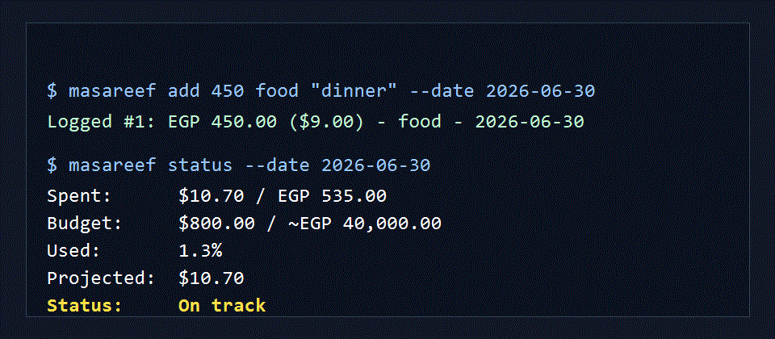
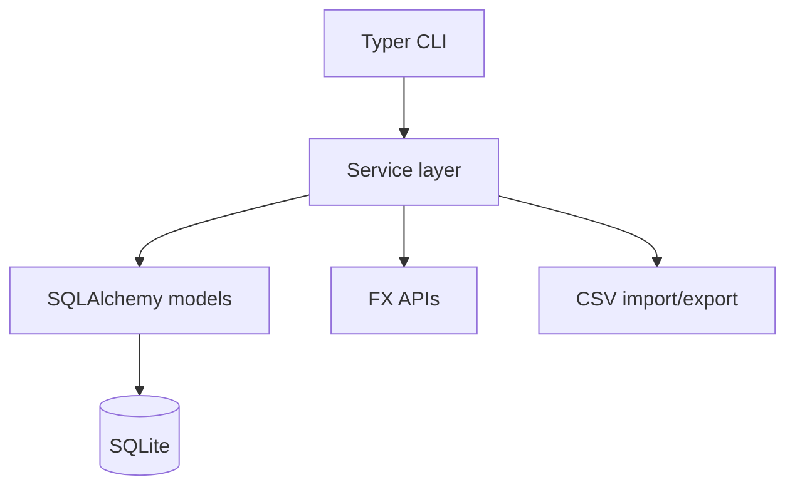

# Masareef

[](https://github.com/ammarkhattab/masareef/actions/workflows/ci.yml)


Masareef is a local-first CLI expense tracker for people who budget in USD and spend in EGP.



## Why This Exists

Masareef is built for Egyptian freelancers and remote workers who earn in USD but spend every day in EGP. It records expenses in pounds, stores the USD value using the historical FX rate for that transaction date, and keeps the monthly budget anchored in dollars.

That means your budget does not drift just because the exchange rate moved.

## Features

- Fast terminal expense logging in EGP.
- Daily USD/EGP FX sync with a fallback API.
- Cached historical FX rates in local SQLite.
- Offline expense logging with stale-rate warnings.
- USD monthly budgets with current-month status and alerts.
- Category management and category totals.
- CSV export/import for backup and spreadsheet analysis.

## Quick Start

```bash
python -m venv .venv
.venv\Scripts\activate
pip install -e ".[dev]"
masareef db init
masareef sync-fx
masareef budget set 800
masareef add 450 food "dinner"
masareef status --date 2026-06-30
```

The database lives in `~/.masareef/masareef.db` by default. Set `MASAREEF_HOME` to use a different directory.

## Installation

From a local checkout:

```bash
pipx install .
```

From GitHub:

```bash
pipx install git+https://github.com/ammarkhattab/masareef.git
```

## Commands

```bash
masareef db init
masareef sync-fx
masareef sync-fx --backfill
masareef categories list
masareef categories add cafes
masareef add 450 food "dinner" --date 2026-06-30
masareef edit 1 --amount 500 --note "updated"
masareef delete 1 --yes
masareef fix-rate 1
masareef list --month 2026-06
masareef budget set 800
masareef budget show
masareef status --date 2026-06-30
masareef alert-check
masareef export csv --output expenses.csv
masareef import csv expenses.csv
```

## Demo

Run a deterministic local demo:

```bash
python -m pip install -e ".[dev]"
powershell -ExecutionPolicy Bypass -File scripts/demo.ps1
```

On Linux/macOS:

```bash
bash scripts/demo.sh
```

The demo uses `.demo-masareef/` as its temporary data directory and seeds a fixed USD/EGP rate so output is repeatable.

Example status output:

```text
Status: 2026-06
Spent:         $10.70 / EGP 535.00
Budget:       $800.00 / ~EGP 40,000.00
Used:         1.3%
Projected:    $10.70
Status:       On track
```

## Development

```bash
python -m pip install -e ".[dev]"
python -m ruff check .
python -m pytest
python -m build
```

The test suite enforces at least 70% coverage.

## Architecture

Masareef is intentionally small:

- `masareef/cli.py`: Typer command layer.
- `masareef/models.py`: SQLAlchemy models.
- `masareef/services/`: business logic for FX, expenses, budgets, categories, CSV, and reports.
- `masareef/utils/`: date and money helpers.
- `tests/`: unit and integration tests using isolated local databases.



## Release

- Current version: `0.1.0`
- Release notes: [CHANGELOG.md](CHANGELOG.md)
- Blog post: [I Built Masareef to Budget in Dollars While Spending in Egyptian Pounds](https://gist.github.com/ammarkhattab/29943f2ff109858afd983391c8bb52c6)

## Contributing

Bug reports and small pull requests are welcome. Before opening a PR, run:

```bash
python -m ruff check .
python -m pytest
python -m build
```

## Privacy

All personal finance data stays local in SQLite. Masareef has no telemetry, no analytics, and no cloud sync.
